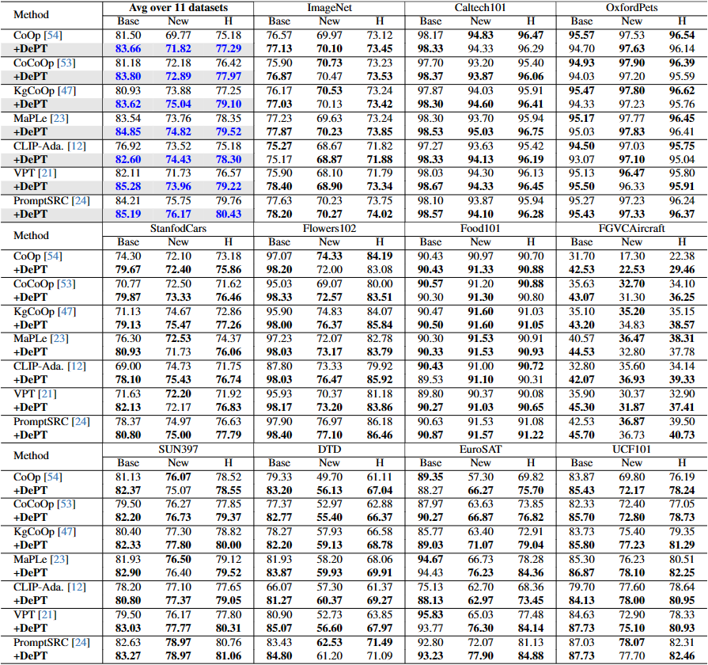
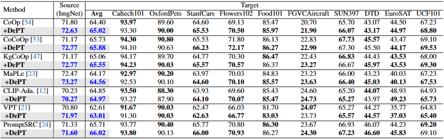
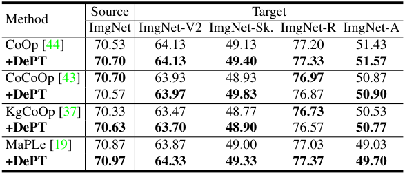

# DePT: Decoupled Prompt Tuning

Offical implementation of the paper [DePT: Decoupled Prompt Tuning](https://arxiv.org/abs/2309.07439)

----

# News

- (Sep 14, 2023)
  - Our paper is published on arXiv.
- (Sep 05, 2023)
  - Training and evaluation codes for DePT are released.

----

# Highlights


> **Abstract** Prompt tuning has shown great success in adapting large vision-language pre-trained models to downstream tasks. A plethora of methods have been proposed to tackle the base- new tradeoff (BNT) dilemma, i.e., the better the adapted model generalizes to the base (a.k.a. target) task, the worse it generalizes to new tasks, and vice versa. Despite this, the BNT problem is still far from being resolved and its underlying mechanisms are poorly understood. In this work, we bridge this gap by proposing Decoupled Prompt Tuning (DePT), a first framework tackling the BNT problem from a feature decoupling perspective. Specifically, through an in-depth analysis on the learned features of the base and new tasks, we observe that the BNT stems from a channel bias issue, i.e., the vast majority of feature channels are occupied by base-specific knowledge, resulting in the collapse oftask-shared knowledge important to new tasks. To address this, DePT decouples base-specific knowledge from feature channels into an isolated feature space during prompt tuning, so as to maximally preserve task-shared knowledge in the original feature space for achieving better zero-shot generalization on new tasks. DePT is orthogonal to existing prompt tuning methods, hence it can tackle the BNT problem for all of them. Extensive experiments on 11 datasets show the strong flexibility and effectiveness of DePT.

----

# Main Contributions

> 1. We provide an insightful view to analyze the BNT problem in prompt tuning, and for the first time reveal that the BNT stems from the channel bias issue.
> 2. We propose the DePT framework to tackle the BNT problem from a feature decoupling perspective, and DePT is orthogonal to existing prompt tuning methods. 
> 3. We perform experiments on 11 diverse datasets and show that DePT consistently enhances the performance of a broad spectrum of baseline methods1.

----

# Results


**Base to New Generalization Performance**

Results reported below show accuracy for base and novel classes for across 11 recognition datasets averaged over 3 seeds.



**Cross Dataset Transfer Performance**

Results reported below show accuracy for source dataset imagenet and other 10 target datasets averaged over 3 seeds.



**Domain Generalization Performance**

Results reported below show accuracy for source dataset imagenet and 4 other target datasets including imagenetv2, imagenet-sketch, imagenet-a and imagenet-r average over 3 seeds.



**Base to New Generalization Performane Under Different Shots**

Results reported below show accuracy for base and novel classes for across 11 recognition datasets under 4,8,16-shots averaged over 3 seeds.


----

# Installation

This codebase is tested on Ubuntu 20.04.2 LTS with python 3.8. Follow the below steps to create environment and install dependencies.

Setup conda environment (recommended).

**Create a conda environment**

```
conda create -y -n dept python=3.8
conda activate dept
```

**Install torch (requires version >= 1.8.1) and torchvision**

```
pip install torch==1.9.0+cu111 torchvision==0.10.0+cu111 torchaudio==0.9.0 -f https://download.pytorch.org/whl/torch_stable.html
```

**Install dassl**

```
git clone https://github.com/KaiyangZhou/Dassl.pytorch.git
cd Dassl.pytorch/
pip install -r requirements.txt
python setup.py develop
```

**Install DePT**

```
cd ..

git clone https://github.com/somebody/DePT.git
cd DePT/

pip install -r requirements.txt
pip install setuptools==59.5.0
```

----

# Data preparation

Please follow the instructions at [DATASETS.md](datasets/DATASETS.md) to prepare all datasets.

----

# Training and Evaluation

We provide parallel running script `parallel_runner.py` for each prompting variant including CoOp (w/ DePT), CoCoOp (w/ DePT), KgCoOp (w/ DePT), MaPLe (w/ DePT). Make sure to configure the dataset paths in environment variable DATA and run the commands from the main directory.

**Base to New Generalization**

```
# Running CoOp (w/ DePT)
python parallel_runner.py --cfg coop
python parallel_runner.py --cfg coop_dept

# Running CoCoOp (w/ DePT)
python parallel_runner.py --cfg cocoop
python parallel_runner.py --cfg cocoop_dept

# Running KgCoOp (w/ DePT)
python parallel_runner.py --cfg kgcoop
python parallel_runner.py --cfg kgcoop_dept

# Running MaPLe (w/ DePT)
python parallel_runner.py --cfg maple
python parallel_runner.py --cfg maple_dept
```

After running, the output will be in the `outputs/` directory, the results will be tallied in the `results/` directory as csv, and a mail will be sent to email address.

If you want to add your own models, you'll need to write your models in the `trainers/` directory and register them in dassl, then configure the settings in the `configs/` directory and `train.py` file, and add your new tasks to the `configs.py` file. Then you can run `python parallel_runner.py --cfg your_model` to run our own model.


----

# Model Zoo

Model checkpoint will be updated soon!

| Name           | Base Acc. | New Acc. | H     | Checkpoints |
| :------------- | :-------- | :------- | :---- | :---------- |
| CoOp w/ DePT   | 83.66     | 71.82    | 77.29 | [link]()    |
| CoCoOp w/ DePT | 83.80     | 72.89    | 77.97 | [link]()    |
| KgCoOp w/ DePT | 83.62     | 75.04    | 79.10 | [link]()    |
| MaPLe w/ DePT  | 84.85     | 74.82    | 79.52 | [link]()    |

----

# Citation

If you use our work, please consider citing
```
@article{zhang2023dept,
  title={DePT: Decoupled Prompt Tuning},
  author={Ji Zhang, Shihan Wu, Lianli Gao, Hengtao Shen and Jingkuan Song},
  journal={arXiv preprint arXiv:2309.07439},
  year={2023}
}
```

----

# Note

We are doing our best to improve this work. If you have any questions or suggestions, please feel free to create an issue on this repo or contact us at jizhang.jim@gmail.com.

----

# Acknowledgements

Our code is based on [CoOp, CoCoOp](https://github.com/KaiyangZhou/CoOp), [KgCoOp](https://github.com/htyao89/KgCoOp) and [MaPLe](https://github.com/muzairkhattak/multimodal-prompt-learning) repository. We thank the authors for releasing their code. If you use our model and code, please consider citing these works as well.